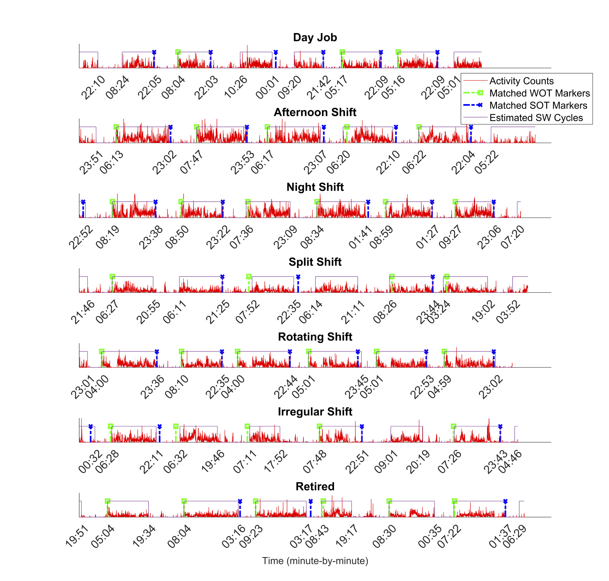
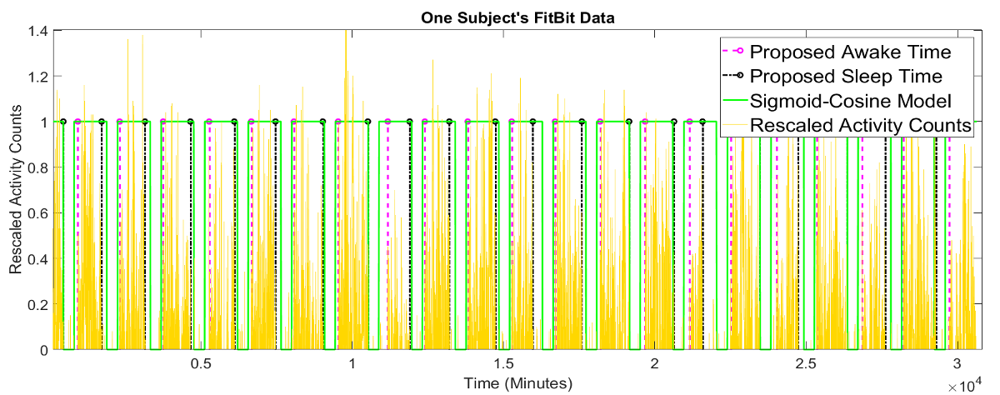

In clinical and epidemiological research these days, researchers are more and more inclined to track one’s physical activity using wearable sensors (e.g. [ActiGraph](https://theactigraph.com/) and [FitBit](https://www.fitbit.com/global/us/products)). Usually, a subject’s activity can be tracked minute by minute, for a long period of time, say days or weeks. This technique is usually referred as actigraphy. 

If the subject wear it all the time, then his/her sleep-wake cycles can also be reflected in the actigraphy data. Sleep-wake cycle detection is a key step when analyzing actigraphy data, which allows us to compute both circadian rhythms and to delineate diurnal physical activity and nocturnal activity.  

With these sleep-wake cycles detected, we can further about one’s sleep habits, such as whether s/he’s a regular sleeper, how long they usually sleep at night, when do they go to sleep and get up etc. These patterns are important metrics in sleep studies, often associated with health outcomes. 

But before we can study how sleep patterns are tied to a health outcome, we must know how to accurately detect such sleep-wake cycles. Numerous supervised detection algorithms have been developed with parameters estimated from and optimized for a particular dataset, yet their generalizability from the sensor to sensor or study to study tends to be poor. Here are some examples of sleep-wake cycles detected by existing algorithms. Quite a lot of misclassifications happened during both sleep period and awake period. 

 

To understand why supervised detection algorithm will not work here, first we need to understand what's activity counts or how activitiy is "counted". 

## Relative Scales of Activity Counts 

“Activity counts” is a troublesome notion. Unlike natural counts that are generated from a counting process, activity counts obtained from the accelerometers are often "artificial", computed by a pred-efined metric to describe the ***intensity*** of the accelerometer signal over a small period of time (also called epoch, usually 30-second or 1-minute). This metric could be RMS, zero-crossing rates, maximum value of acceleration in that epoch etc. etc., depending on the researcher who's devising the metric or the manufacturers' proprietary algorithm. As a result, activity counts in essense is the intensity on a relative scale, without a unified units among different types of sensors. In other words, the same activity done by the same subject at one time point can vary by the accelerometers' sampling rates, wearing locations, sensor range, quantization scheme (bits), manufacturers' aggregation scheme, and thresholding etc. Distributions of such intensity data (e.g. time series of seismic moments and precipitation intensity) usually show long-tail, zero-inflated patterns. 

Supervised algorithms, let alone the tedious and impractical label-collection work (reference data), cannot excel at transferring between different data collection setups. One problem is the windowing step under a machine-learning framework. As structural changes in features can happen over various
timescales, a fixed window length cannot capture structural changes adequately. Often, such window-based methods produce fragments of an activity state and the results need to be smoothed by an ad hoc temporal filter (e.g. a median filter) or heuristic rules, which can further reduce the temporal
resolution of the detection. Thus, regression coefficients from study done using one sensor to another sensor type.

## Circadian Rhythm and Sleep-Wake Cycle Detection 
 
We propose an unsupervised algorithm – CircaCP -- to detect sleep-wake cycles from minute-by-minute actigraphy data. It first uses a robust cosinor model to estimate circadian rhythm, then searches for a single change point (CP) within each cycle using a [statistical change point detection](https://en.wikipedia.org/wiki/Change_detection) method. We used CircaCP to estimate sleep/wake onset times (S/WOTs) from 2125 individuals' data in the [MESA Sleep study](https://sleepdata.org/datasets/mesa), and compared the estimated S/WOTs against self-reported S/WOT events markers. Here are some examples of sleep-wake cycles detected by our CircaCP algorithm:

## Generalizability and External Validation

In fact, CircaCP has been seamlessly applied to mulitple actigraphy datasets collected on different populations (e.g. [children](https://arxiv.org/pdf/1904.05313.pdf), [adult multiple sclerosis patients](https://www.ncbi.nlm.nih.gov/pmc/articles/PMC9350909/), and [adult aging population](https://arxiv.org/pdf/2111.14960.pdf)), with different sensors (ActiGraph, ActiWatch, or FitBit), on different wearing locations (hip or wrist). 

 

Leveraging the large sample size of MESA Sleep Study, we [validated CircaCP algorithm](https://arxiv.org/pdf/2111.14960.pdf) against the event markers on the biases between estimated and self-reported S/WOTs and quantified sources of variation in S/WOTs, considering both between-subject variability and the day-to-day, within-subject variability, using linear mixed-effects models and variance component analysis. On average, SOTs estimated by CircaCP were ***only five minutes*** behind those reported by event markers, and WOTs estimated by CircaCP were ***less than one minute*** behind those reported by markers. These differences accounted for less than ***0.2% variability*** in SOTs and in WOTs, taking into account other sources of between-subject variations.

***Takeaway message***: By focusing on the commonality in human circadian rhythms captured by actigraphy, CircaCP presents an accurate and unsupervised solution for detecting sleep-wake cycles. It has transferred seamlessly from hip-worn ActiGraph data collected from children in our previous study to wrist-worn Actiwatch data collected from adults. The large between- and within-subject variability highlights the need for estimating individual-level S/WOTs when conducting actigraphy research. The generalizability of CircaCP has enabled its wide application to actigraphy data collected by different types of wearable sensors.

## Open Source Code 
CircaCP is downloadable from [my Github repository](https://github.com/ShanshanChen-Biostat/CircaCP)

