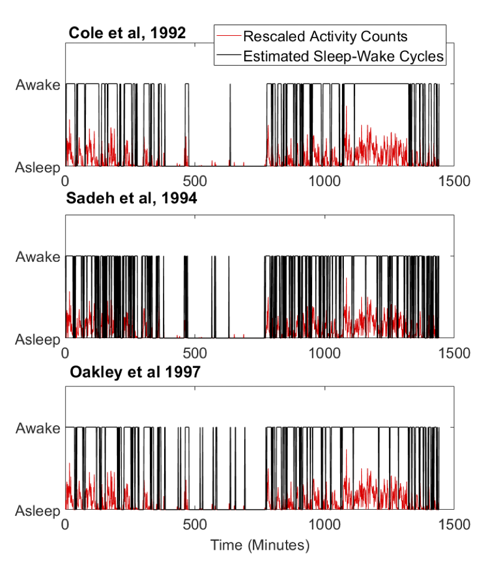

In clinical and epidemiological research these days, researchers are more and more inclined to track one’s physical activity using wearable sensors (e.g. [ActiGraph](https://theactigraph.com/) and [FitBit](https://www.fitbit.com/global/us/products)). Usually, a subject’s activity can be tracked minute by minute, for a long period of time, say days or weeks. This technique is usually referred as actigraphy. 

If the subject wear it all the time, then his/her sleep-wake cycles can also be reflected in the actigraphy data. Sleep-wake cycle detection is a key step when analyzing actigraphy data, which allows us to compute both circadian rhythms and to delineate diurnal physical activity and nocturnal activity.  

With these sleep-wake cycles detected, we can further about one’s sleep habits, such as whether s/he’s a regular sleeper, how long they usually sleep at night, when do they go to sleep and get up etc. These patterns are important metrics in sleep studies, often associated with health outcomes. 

But before we can study how sleep patterns are tied to a health outcome, we must know how to accurately detect such sleep-wake cycles. Numerous supervised detection algorithms have been developed with parameters estimated from and optimized for a particular dataset, yet their generalizability from the sensor to sensor or study to study is not great. Here are some examples of sleep-wake cycles detected by existing algorithms:

To understand why supervised detection algorithm will not work here, first we need to understand how activitiy is counted. 

## Relative Scales of Activity Counts 

Currently, there is no unified scale for these activity counts.

## Circadian Rhythm and Sleep-Wake Cycle Detection 
 

We propose an unsupervised algorithm – CircaCP -- to detect sleep-wake cycles from minute-by-minute actigraphy data. It first uses a robust cosinor model to estimate circadian rhythm, then searches for a single change point (CP) within each cycle using a parameter CP detection method. We used CircaCP to estimate sleep/wake onset times (S/WOTs) from 2125 individuals' data in the MESA Sleep study, and compared the estimated S/WOTs against self-reported S/WOT events markers. Lastly, we estimated the biases between estimated and self-reported S/WOTs and quantified sources of variation in S/WOTs, considering both between-subject variability and the day-to-day, within-subject variability, using linear mixed-effects models and variance component analysis.

On average, SOTs estimated by CircaCP were six minutes behind those reported by event markers and WOTs estimated by CircaCP were less than one minute behind those reported by markers. These differences accounted for less than 0.25% variation in SOTs and WOTs.  Between-subject variability and day-to-day variability are the two biggest variance components, accounting for 50% to 80% of the total variance.  

By focusing on the commonality in human circadian rhythms captured by actigraphy, our algorithm transferred seamlessly from hip-worn ActiGraph data collected from children in our previous study to wrist-worn Actiwatch data collected from adults.  The large between- and within-subject variability highlights the need for estimating individual-level S/WOTs when conducting actigraphy research. The generalizability of our algorithm also suggests that it could be widely applied to actigraphy data collected by other wearable sensors.

## Diurnal Physical Activity vs Nocturnal Physical Activity 

