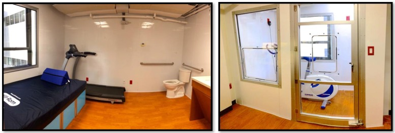

Reduced energy expenditure (EE) in sedentary lifestyle has been linked to the dramatic rise in obesity, Type II
diabetes, and heart disease in modern society. To study
this epidemic and ultimately motivate expending more
energy in daily life, accurately monitoring of EE for each
individual is desired. However, current accurate EE
assessment is still limited to expensive laboratory tools,
which are often challenged by the ease of use, accessibility
and portability and therefore fail to meet the requirements
for long-term, remote, personal EE monitoring.

## Energy Metabolism 
Human EE is comprised of various components and is infuenced by many factors. The largest component
of human EE is resting EE, which is the energy required to carry out fundamental physiological functions,
contributing 60–80% of the total daily EE. REE is infuenced by various physiological characteristics, including gender, ethnicity,
age, body composition, various metabolic syndromes, and gene variations.
Additionally, resting EE responds to environmental stimuli, such as cold temperatures, food intake
and dietary composition. Moreover, REE drops signifcantly during sleep25 and varies by circadian phase26.
A smaller, yet important component of human EE is activity-induced EE (AEE). Activities can be subdivided
into two categories: non-exercise activity thermogenesis (NEAT) and volitional exercise. NEAT includes
occupational and leisure activities and any spontaneous activities, such as fdgeting and maintenance of posture.
Because of these factors, REE needs to be assessed under controlled experimental conditions. By providing
environmental control and real-time measurements over extended periods, Whole-room Indirect Calorimeer are the perfect tools to isolate
the various components of EE.

## Why Smart Wearable Sensors aren't Enough for Estimating Energy Expenditure 

## Whole-room Indirect Calorimeer 

At [VCU](https://www.vcu.edu/), I supervise the operations of two whole-room indirect calorimeters (a.k.a human metabolic chambers), located at the [Clinical Research Service Unit (CRSU)](https://cctr.vcu.edu/support/clinical-research-service-providers/clinical-research-unit/). 

This powerful measurement instrument lends an important perspective for physicians to study metabolism clinically by providing a continuous and objective assessment of resting energy expenditure and respiratory exchange ratio, whilst providing a near-free living environment. Besides routine maintenance, I have worked on system integration, improvement, optimization, and error characterization of this instrument. For example, I proposed a solution based on [novel signal processing techniques](https://journals.plos.org/plosone/article?id=10.1371/journal.pone.0193467) that allows researchers to collect dynamic metabolic signals (e.g. during short-interval exercises) which were not previously possible. This solution has also been [validated against conventional metabolic carts](https://www.nature.com/articles/s41598-020-71001-1). This instrument has been used in multiple clinical studies at VCU. 

